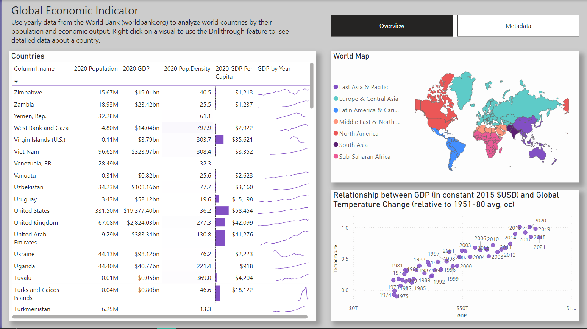
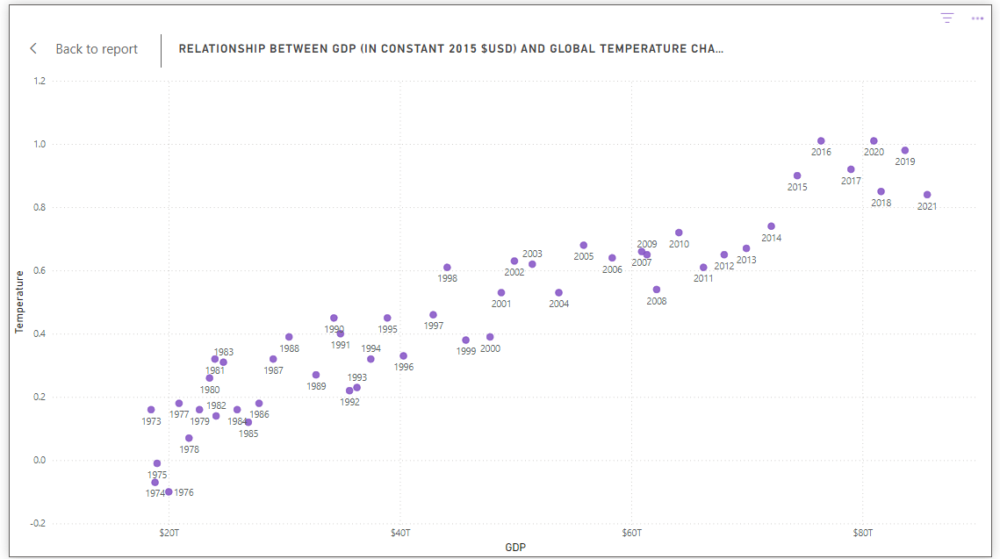
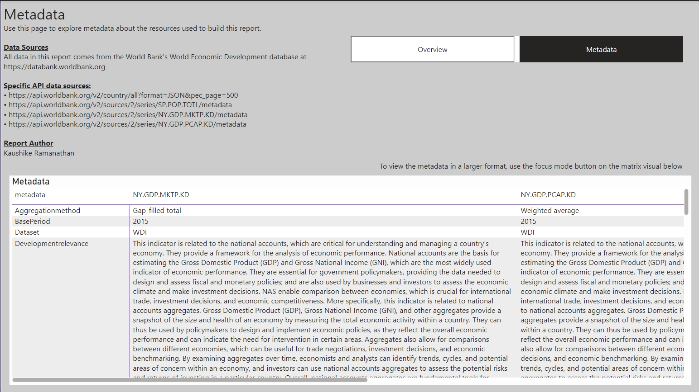

# 🌐 Global Economic Indicator Dashboard

> **Author**: Kaushike Ramanathan  
> **Data Source**: [World Bank Open Data](https://databank.worldbank.org)

An interactive Power BI dashboard using **50 years of global economic and climate data** from the World Bank. This project explores population, GDP, and temperature trends with powerful visuals, dynamic filters, and drillthrough features.

---

## 📌 Overview

This report visualizes key global economic indicators over time and across regions:
- **GDP trends by country**
- **Population and density**
- **Correlation between GDP and global temperature change**
- **Country-wise drillthrough exploration**
- **API-based metadata insights**

The dashboard enables users to gain insights into how economic growth aligns with environmental impact and population factors.

---

## 🧰 Features Used

### 📊 **Visualizations**
- **Stacked column & line combo charts** for GDP and GDP growth % (dual-axis)
- **Sparklines** to show GDP trends over time in table format
- **Conditional formatting** on population density and GDP per capita
- **Scatter plot** showing the **positive linear correlation** between GDP and temperature change
- **Color-coded map** of countries by regions using World Bank-defined categories

### 🧭 **Drillthrough Page**
- Users can right-click on a country name to drill through to a detailed country page with:
  - Annual GDP
  - GDP per capita
  - GDP growth %
  - Population over years
  - Dynamic KPIs in card format

### 🔄 **Power Query Transformations**
- Merged multiple datasets (population, GDP, temperature) from different World Bank API endpoints
- Cleaned and shaped data using Power Query Editor
- Built lineage views to trace transformation pipelines

### 📐 **DAX Measures**
- Created calculated columns for:
  - **GDP per capita**
  - **Annual GDP Growth %**
- Used KPI indicators (🟢/🔴 arrows) with DAX-based logic

### 📁 **Metadata Page**
- Lists World Bank API endpoints used
- Explains each dataset’s aggregation method, base period, and development relevance
- Transparency around data source credibility and methodology

---

## 📷 Screenshots

### Dashboard Overview

### Country Drillthrough

### Scatter Plot – GDP vs Temperature

### Metadata Page

---

## 🌍 Data Sources

This report uses datasets from the **World Development Indicators (WDI)** catalog:

| Data | API Source |
|------|-------------|
| Population | [`SP.POP.TOTL`](https://api.worldbank.org/v2/en/indicator/SP.POP.TOTL) |
| GDP (Constant 2015 USD) | [`NY.GDP.MKTP.KD`](https://api.worldbank.org/v2/en/indicator/NY.GDP.MKTP.KD) |
| GDP Per Capita | [`NY.GDP.PCAP.KD`](https://api.worldbank.org/v2/en/indicator/NY.GDP.PCAP.KD) |
| Population Density | [`EN.POP.DNST`](https://api.worldbank.org/v2/en/indicator/EN.POP.DNST) |
| Temperature Change | NASA GISTEMP Global Mean (via external CSV) |

---

## 🚀 How to Use

1. Clone or download this repository
2. Open `global-economic-dashboard.pbix` in Power BI Desktop
3. Explore interactive visuals or edit Power Query and DAX logic

---

## 🎓 Learning Outcomes

This project was built as part of the "Analyzing and Visualizing Data with Power BI" course. Skills gained include:

- Advanced Power Query data shaping
- Dynamic DAX calculations
- Scatter plots and sparklines
- Drillthrough navigation
- Understanding data lineage and model relationships
- Metadata documentation for transparency

---

## 📌 Author

**Kaushike Ramanathan**  
Engineering Student • Data Enthusiast • Power BI Developer  
[LinkedIn](https://linkedin.com/in/yourprofile) | [GitHub](https://github.com/yourusername)

---

